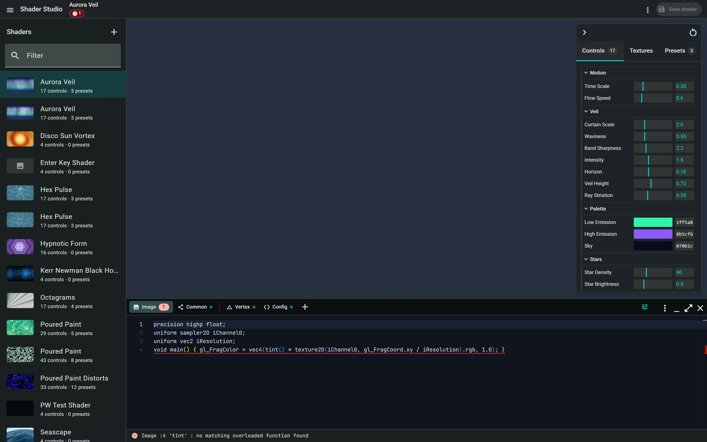

<div align="center">
  <h1>Shader Studio</h1>
  <p><strong>Your self-hosted workspace for building, tuning, and collecting WebGL shaders.</strong></p>
  <p>
    Browse a shader library, edit GLSL with live diagnostics, generate controls from a schema,
    save presets, and move everything between installations as portable JSON.
  </p>

  <p>
    <a href="https://github.com/antelm-dev/shader-studio/actions/workflows/ci.yml"></a>
    <a href="https://angular.dev/"></a>
    <a href="https://nodejs.org/"></a>
    <a href="https://pnpm.io/"></a>
  </p>
</div>

<br />



The shader you select becomes the application canvas, so you edit the thing you
are looking at. A broken draft never blanks the preview: Shader Studio keeps the
last valid version running and places compiler diagnostics in the editor.

## Highlights

- **Live GLSL workflow** — Monaco editing, driver-backed diagnostics, and a safe
  compile pipeline that preserves the last working render.
- **Schema-generated controls** — describe numbers, booleans, colors, and selects
  once; Shader Studio builds the control panel and uniforms for you.
- **A library that stays yours** — shaders and presets live as readable files on
  disk, with atomic writes and no external database.
- **Portable by design** — export one shader or the complete collection to a
  versioned JSON bundle and import it elsewhere.
- **Interactive previews** — pointer velocity, click ripples, pause, screenshots,
  bloom, render scaling, and texture inputs are built in.
- **Web and desktop** — run the SSR web app on your own machine or package the
  Electron desktop app for Windows.

## Contents

- [Quick start](#quick-start)
- [Self-hosting](#self-hosting)
- [Desktop app](#desktop-app)
- [Using Shader Studio](#using-shader-studio)
- [Shader format](#shader-format)
- [Import and export](#import-and-export)
- [API](#api)
- [Included shaders](#included-shaders)
- [Architecture](#architecture)
- [Development](#development)
- [Tests](#tests)
- [Known limitations](#known-limitations)

## Quick start

### Requirements

- Node.js `^22.22.3 || ^24.15.0 || >=26`
- [pnpm](https://pnpm.io/) 10

Clone the repository and its two linked Electron helpers, then start the
development server:

```bash
git clone https://github.com/antelm-dev/shader-studio.git
cd shader-studio
mkdir -p ../electron-libs
git clone https://github.com/antelm-dev/electron-ipc-module.git ../electron-libs/ipc-module
git clone https://github.com/antelm-dev/electron-run.git ../electron-libs/electron-run
pnpm install
pnpm dev
```

The linked helpers are currently required during dependency installation even
when you only intend to run the web application.

Open [http://localhost:4200](http://localhost:4200). The development server runs
the real Express API and SSR application; the API is not mocked.

## Self-hosting

### Docker

The fastest way to run Shader Studio. It needs nothing but Docker — neither
Node.js nor the linked Electron helpers:

```bash
git clone https://github.com/antelm-dev/shader-studio.git
cd shader-studio
docker compose up -d
```

Shader Studio is then available at [http://localhost:4000](http://localhost:4000),
with the four example shaders already seeded.

Your shaders live in the `shader-data` volume, mounted at `/data`; everything
else in the image is disposable. Reaching the app under any name other than
`localhost` — a machine name on your LAN, a domain behind a reverse proxy —
means telling SSR about it, otherwise the request is rejected:

```bash
SHADER_ALLOWED_HOSTS=localhost,127.0.0.1,[::1],shaders.example.com docker compose up -d
```

`docker-compose.yml` also reads `SHADER_PORT` (host port, default `4000`) and
`SHADER_SEED`. To upgrade, pull and rebuild with `docker compose up -d --build`;
the volume is left alone.

### From source

Build the production application and run its Node server:

```bash
pnpm build
pnpm serve:ssr
```

Shader Studio is then available at [http://localhost:4000](http://localhost:4000).
Persist the directory configured by `SHADER_DATA_DIR`; it contains the complete
shader library. When exposing the app beyond localhost, set `NG_ALLOWED_HOSTS`
to the hostnames that are allowed to reach SSR.

> [!IMPORTANT]
> Shader Studio has no authentication or multi-user isolation. Deploy it only on
> a trusted private network, behind an authenticated reverse proxy, or through a
> private access layer.

### Configuration

| Variable              | Default                     | Purpose                                                           |
| --------------------- | --------------------------- | ----------------------------------------------------------------- |
| `PORT`                | `4000`                      | Port for the SSR server                                           |
| `SHADER_DATA_DIR`     | `./data`                    | Persistent shader storage                                         |
| `SHADER_EXAMPLES_DIR` | `./examples`                | Source directory for bundled examples                             |
| `SHADER_SEED`         | —                           | Set to `0` to disable seeding an empty store                      |
| `NG_ALLOWED_HOSTS`    | `localhost,127.0.0.1,[::1]` | Comma-separated hosts SSR may render for; set this when deploying |

## Desktop app

The Electron target currently packages for Windows:

```bash
pnpm dev:desktop  # Angular dev server + Electron with main-process reload
pnpm pack:win     # unpacked app in release/win-unpacked
pnpm dist:win     # NSIS installer and portable executable in release/
```

The desktop target uses the linked sibling packages
`../electron-libs/ipc-module` and `../electron-libs/electron-run`. It stores its
library in Electron's per-user application-data directory and does not start the
Express server. The web and SSR targets continue to use the REST API.

## Development

The application uses Angular 22 (zoneless SSR), Angular Material, Express,
three.js, lil-gui, and Monaco.

| Script           | What it does                         |
| ---------------- | ------------------------------------ |
| `pnpm dev`       | Dev server with HMR, SSR and the API |
| `pnpm build`     | Production build into `dist/`        |
| `pnpm serve:ssr` | Run the built SSR server             |
| `pnpm test`      | Unit tests (Vitest)                  |
| `pnpm lint`      | Oxlint                               |
| `pnpm format`    | Oxfmt                                |
| `pnpm typecheck` | `tsc -b`, strict                     |

## Using Shader Studio

### Keyboard shortcuts

| Key               | Action                        |
| ----------------- | ----------------------------- |
| `Space`           | Pause / resume time           |
| `H`               | Show / hide the controls      |
| `S`               | Save the frame as a PNG       |
| `Ctrl`+`S`        | Save the shader               |
| `Shift`+`Alt`+`F` | Format the GLSL in the editor |

### The editor

Right-click the editor's toolbar for its menu.

- **Format GLSL** re-indents by block depth and does nothing else. No rewrapping,
  no spacing opinions: a shader is dense numeric code whose columns are usually
  aligned on purpose, and a formatter that argues with that is one people turn
  off.
- **Copy full GLSL** copies the fragment as a file that stands on its own — the
  source plus the declarations the engine would otherwise have supplied: the
  precision qualifier, the built-in uniforms, and one `uniform` per control.
  Anything the source already declares is left alone, so the result never
  redeclares its way into a compile error somewhere else.

Typing offers snippets for the things you would otherwise be looking up: `main`,
`uv`, `ripple` (the `u_clickData` loop), `channel`, `palette`, `hash21`, `noise`,
`fbm`, `rot2` and `uniform`.

### Presets

A preset captures the live parameter values under a name. Ticking **Also capture
the render settings** when saving stores the shader's bloom alongside them, and
applying that preset brings it back — which, since bloom belongs to the shader
rather than to the knobs, leaves the document with unsaved changes. Presets
saved without it never touch bloom. The ones that carry it are marked with a
bloom icon on their chip.

On desktop, **More actions → Open output window** opens a clean, independently
resizable render surface. It follows the active draft, live parameters, pause
state, render scale, and texture assignments, making it suitable for a second
monitor or projector while the main window remains the control workspace.

Move the pointer over the background to push the shader around; click to drop a
ripple. Both are fed to the shader as uniforms (see below) — what a shader does
with them is up to it.

---

## Architecture

Four concerns, kept apart on purpose. Nothing below the line knows about Angular.

```
src/
  shared/          model + validation — imported by BOTH the server and the client
    model.ts         the shader document: controls, presets, bundles
    validate.ts      every rule, in one place. The API is the authority; the
                     client reuses it to pre-validate the config editor.

  server/          Node only
    storage.ts       file-backed persistence: atomic writes, per-shader locks,
                     path-traversal defence, example seeding
    api.ts           the REST routes — thin; they parse, delegate, map errors
  server.ts        Express: mounts /api, then server-renders everything else

  app/
    core/          state and transport
      shader-store.ts  the single source of truth (signals)
      shader-api.ts    HTTP client
      preferences.ts   localStorage-backed workspace prefs
    rendering/     three.js. Knows nothing about HTTP or the DOM beyond a canvas
      shader-engine.ts     compile, uniforms, ripples, bloom, screenshots
      glsl-diagnostics.ts  driver info-logs -> editor markers
      shader-canvas.ts     the only place the store is wired to the engine
    gui/           lil-gui, generated from the control schema
    editor/        Monaco
    ui/            Material components: browser, presets, editor panel, dialogs
```

The store keeps three layers of state deliberately distinct:

- **record** — the shader as the server last gave it to us.
- **draft** — the editor buffers. The difference from `record` is what "unsaved
  changes" means, and what `Save` sends.
- **params** — the live uniform values. Turning a knob is _not_ an unsaved edit to
  the source; it is a value you can capture as a preset.

### SSR

Express serves the API and renders the app in the same process. During SSR the
app calls its own `/api` over a same-origin request (the absolute origin comes
from the incoming request; see `app.config.server.ts`).

The rendered state is handed to the browser through Angular's `TransferState`, so
the first client render is identical to the server's markup and hydration does
not throw the page away. The server deliberately opens the _first_ shader rather
than the last one you had open — it cannot read your `localStorage`, and
rendering a different shader than the client would then hydrate is exactly the
mismatch the snapshot exists to prevent. The client switches to your remembered
shader once it takes over.

three.js, lil-gui and Monaco are all **dynamically imported**: none of them exist
on the server (lil-gui injects a stylesheet at import time and would throw), and
keeping them out of the initial bundle lets the shell paint first.

### Compiling without breaking the preview

A candidate shader is compiled against an offscreen 1×1 render target before it
is allowed anywhere near the screen. Only if the driver accepts it does the live
material get swapped. If it does not, the previous shader keeps rendering and the
driver's log comes back as diagnostics.

Line numbers in a driver's log count from the top of the source _three.js_
assembled, which is not the source you typed — three prepends a prelude. The
engine finds your source inside the full source and subtracts the offset, so a
diagnostic lands on the line you are actually looking at.

---

## Shader format

One directory per shader. The directory name is the id — it is the primary key,
which is why it is validated before it is ever joined onto a path.

```
data/
  .seeded                    marker; stops examples coming back after you delete them
  shaders/
    poured-paint/
      meta.json              name, description, control schema, render settings
      fragment.glsl          the fragment shader
      vertex.glsl            the vertex shader
      presets.json           { "presets": [ ... ] }
```

`examples/shaders/` uses exactly this layout, and is copied into `data/` the first
time you run an empty store. `data/` is gitignored; `examples/` is not.

Writes are atomic (temp file + rename), and mutations of a given shader are
serialized, so a half-written `meta.json` is never observable.

**Ids** are lowercase letters, digits and inner hyphens — no dots, no separators.
That rules out `..`, hidden files, and Windows' reserved device names. Renaming a
shader changes its display name only; the id, and therefore the path, is stable.

### `meta.json`

```json
{
  "name": "Hex Pulse",
  "description": "A hexagonal lattice that answers back.",
  "author": "Shader Studio",
  "createdAt": "2026-07-12T00:00:00.000Z",
  "updatedAt": "2026-07-12T00:00:00.000Z",
  "controls": [/* see below */],
  "render": {
    "bloom": { "enabled": true, "strength": 0.55, "radius": 0.55, "threshold": 0.65 }
  }
}
```

### `presets.json`

```json
{
  "presets": [
    {
      "id": "solar-storm",
      "name": "Solar Storm",
      "createdAt": "2026-07-12T00:00:00.000Z",
      "values": { "timeScale": 1.4, "colorLine": "#ff7a3d" },
      "render": {
        "bloom": { "enabled": true, "strength": 1.2, "radius": 0.4, "threshold": 0.7 }
      }
    }
  ]
}
```

`render` is optional and usually absent: a preset without it restores the values
and leaves the shader's own bloom alone. `values` are projected onto the current
control schema when applied — anything the schema no longer declares is dropped,
and a number outside a narrowed range is clamped rather than discarded, so a
preset outlives the edits made to the shader underneath it.

---

### Control schema

A shader declares its parameters; the GUI is generated from that declaration. No
shader ever writes GUI code. Add a control in the **Config** tab and its knob
appears immediately, bound to a uniform, without a reload.

**The rule: a control keyed `warpIntensity` feeds `uniform float u_warpIntensity`.**
The uniform is always the key prefixed with `u_`.

| `type`    | GLSL uniform    | Widget       | Required fields                       |
| --------- | --------------- | ------------ | ------------------------------------- |
| `number`  | `float u_<key>` | slider       | `default`, `min`, `max`, (`step`)     |
| `boolean` | `bool u_<key>`  | checkbox     | `default`                             |
| `color`   | `vec3 u_<key>`  | color picker | `default` as `#rrggbb`                |
| `select`  | `float u_<key>` | dropdown     | `default`, `options` (label → number) |

`label` (GUI text) and `folder` (grouping) are optional on all of them.

```json
[
  {
    "key": "timeScale",
    "type": "number",
    "label": "Time Scale",
    "folder": "Motion",
    "default": 0.5,
    "min": 0,
    "max": 2
  },
  { "key": "mirror", "type": "boolean", "label": "Mirror", "folder": "Flight", "default": false },
  {
    "key": "colorLine",
    "type": "color",
    "label": "Lattice",
    "folder": "Palette",
    "default": "#54e0ff"
  },
  {
    "key": "paletteMode",
    "type": "select",
    "label": "Palette Mode",
    "folder": "Palette",
    "default": 1,
    "options": { "Classic": 0, "Neon": 1, "Ember": 2 }
  }
]
```

Colors are passed to the shader as **display-space sRGB** `vec3` (three.js's
colour management is off), which is what you almost certainly want when you pick
`#54e0ff` and expect to see `#54e0ff`.

### Built-in uniforms

Provided to every shader whether it declares them or not. Declare the ones you use.

```glsl
uniform vec2  iResolution;             // drawing-buffer size, pixels
uniform float iTime;                   // seconds; pausable, and it does not
                                       // fast-forward when you resume
uniform vec4  iMouse;                  // xy: pointer in pixels, z: 1 while pressed
uniform vec2  iMouseVel;               // pointer velocity, pixels/second
uniform vec3  u_clickData[__MAX_WAVES__]; // per click: xy pixels, z = birth time
                                          // (z <= 0 means the slot is unused)
```

`__MAX_WAVES__` is substituted with the ripple-slot count (24) before compiling,
so use it for the array size and any loop bound. `examples/shaders/hex-pulse` is
the worked example.

The vertex shader is an ordinary three.js `ShaderMaterial` vertex shader, and gets
`position`, `uv`, `projectionMatrix` and `modelViewMatrix`. The default passes
`vUv` through, which is all a full-screen shader needs.

### Editing the schema

Changing the controls re-projects every preset onto the new schema: a value for a
control you deleted is dropped, and a value now out of range is **clamped** rather
than discarded — a preset saved before you narrowed a slider is still worth
keeping. A schema that does not parse is reported in the diagnostics strip, blocks
saving, and leaves the working GUI alone.

---

## Import and export

One documented format, used for both a single shader and a whole collection.
Everything needed to reproduce a shader elsewhere is in it: source, schema, render
settings and presets.

`GET /api/shaders/:id/export` →

```json
{
  "format": "shader-studio/v1",
  "kind": "shader",
  "exportedAt": "2026-07-12T12:00:00.000Z",
  "shader": {
    "id": "hex-pulse",
    "name": "Hex Pulse",
    "description": "...",
    "author": "Shader Studio",
    "controls": [/* the schema */],
    "render": { "bloom": {/* ... */} },
    "fragment": "precision highp float; ...",
    "vertex": "varying vec2 vUv; ...",
    "presets": [
      {
        "id": "circuit",
        "name": "Circuit",
        "createdAt": "...",
        "values": { "timeScale": 0.5, "colorPulse": "#5ef2ff" }
      }
    ]
  }
}
```

`GET /api/export` returns the same thing with `"kind": "collection"` and a
`"shaders": [ ... ]` array of those payloads. Import accepts either kind.

**Import modes.** `rename` (the default) never destroys anything: a shader whose id
already exists is given a fresh, suffixed one. `overwrite` replaces the shader
holding that id, which is what makes an export → import round trip idempotent. The
UI asks before it overwrites.

Bundles are validated on the way in, and a bundle with a broken id but a usable
name is recovered rather than rejected — hand-edited files are expected.

---

## API

All errors are `{ "error": { "code", "message", "details"? } }`.
`400` invalid · `404` not found · `409` conflict.

| Method   | Route                                | Purpose                                         |
| -------- | ------------------------------------ | ----------------------------------------------- |
| `GET`    | `/api/shaders`                       | List (summaries)                                |
| `POST`   | `/api/shaders`                       | Create from the template                        |
| `GET`    | `/api/shaders/:id`                   | Read one, in full                               |
| `PUT`    | `/api/shaders/:id`                   | Partial update (name, source, controls, render) |
| `DELETE` | `/api/shaders/:id`                   | Delete                                          |
| `POST`   | `/api/shaders/:id/duplicate`         | Copy, presets included                          |
| `GET`    | `/api/shaders/:id/presets`           | List presets                                    |
| `POST`   | `/api/shaders/:id/presets`           | Save; reusing a name overwrites                 |
| `DELETE` | `/api/shaders/:id/presets/:presetId` | Delete a preset                                 |
| `GET`    | `/api/shaders/:id/export`            | Export one                                      |
| `GET`    | `/api/export`                        | Export everything                               |
| `POST`   | `/api/import`                        | Import a bundle                                 |

Preset values are sanitized against the shader's schema on save, so a preset can
never carry a value for a control that does not exist.

---

## Included shaders

| Shader           | Shows                                                                                                                                                                                                                         |
| ---------------- | ----------------------------------------------------------------------------------------------------------------------------------------------------------------------------------------------------------------------------- |
| **Poured Paint** | 43 controls. Domain-warped fbm, layers quantized into pooled bands with hard contour lips, wet specular relief, OKLab palette ramp, click ripples with chromatic dispersion, and momentum-tunable pointer smearing. Bloom on. |
| **Aurora Veil**  | Curtains draped by warping the x axis with slow noise, over a twinkling star field.                                                                                                                                           |
| **Hex Pulse**    | `u_clickData`: click and a wavefront crosses the lattice. Hover lights the cells under the cursor.                                                                                                                            |
| **Warp Tunnel**  | A tunnel from `1/r` — no raymarching. Demonstrates `select` and `boolean` controls.                                                                                                                                           |

Poured Paint and its five presets are carried over from the project this app grew
out of, and are the reference for what the format can express.

---

## Tests

```bash
pnpm test
```

201 tests, focused where a bug would actually cost you something:

- **`shared/validate.spec.ts`** — ids (every traversal and reserved-name case),
  the control schema, preset sanitization and clamping, and bundle round-trips.
- **`server/storage/shader-storage.spec.ts`** — runs against a real temp
  directory, not a mocked fs, because the whole point of that layer is what it
  does to the filesystem and a mock would let a traversal bug through. Covers
  CRUD, path traversal, atomic update, preset lifecycle, import modes, and
  seeding.
- **`core/shader-store.spec.ts`** — the client-side store: selection, dirty
  tracking, save/discard paths, and preset application.
- **`ui/document-status.spec.ts`** — the saved/dirty/saving indicator, including
  the debounce timing.
- **`core/draft-recovery.spec.ts`** and **`core/panel-prefs.spec.ts`** — what
  survives a reload: unsaved drafts, and panel sizes.
- **`rendering/glsl-diagnostics.spec.ts`** — both driver log dialects, and the
  prelude offset that makes a line number point at the right line.
- **`rendering/glsl-export.spec.ts`** — the generated uniform prelude, and above
  all what it declines to generate: a declaration the source already carries
  would be a redeclaration error wherever the copy is pasted.
- **`editor/glsl-format.spec.ts`** — indentation depth, braces that are only
  part of a comment, and idempotence.
- **`rendering/shadertoy-import.spec.ts`** — the Shadertoy source rewrite.

---

## Known limitations

- **One WebGL context.** Only the selected shader renders; there are no thumbnails
  in the browser list.
- **No auth, no multi-user.** The API writes to the local filesystem and assumes a
  single trusted user. It is a studio, not a service.
- **Bloom is the only post effect**, and it is a shader-level setting rather than
  something a preset can capture.
- **Monaco's stylesheet is global** (~88 kB gzipped), not lazy: the CSS its ESM
  modules import lands in a chunk nothing links, so the editor comes out
  structurally unstyled if you rely on it. The editor's _code_ is still lazy.
- **`renderer.compile` uses a real draw call** to a 1×1 target to force a compile.
  It is the only reliable way to make three.js compile eagerly, but it does mean a
  recompile costs one hidden frame.
- GLSL diagnostics come from the driver, so their exact wording varies by
  browser and GPU.
